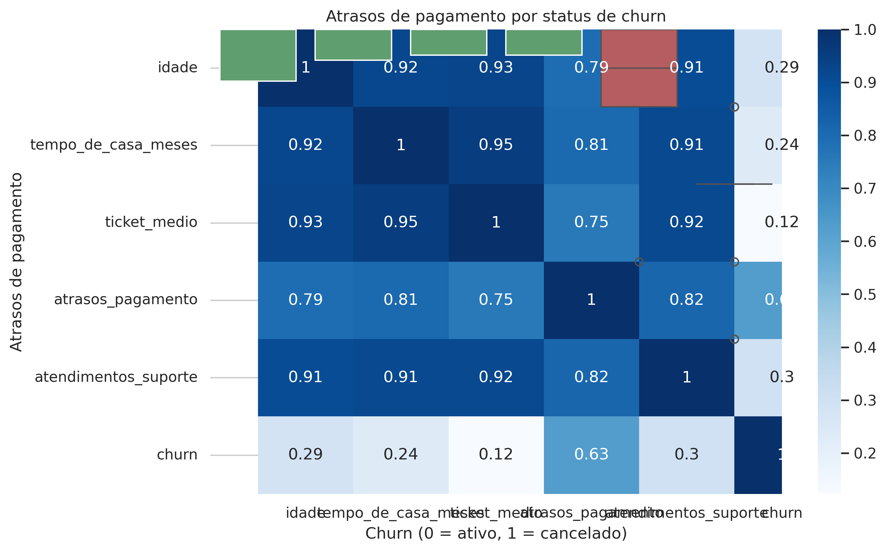

<h1 align="center">📉 Churn Analysis em Python</h1>

<p align="center">
  <strong>Análise exploratória completa para identificar padrões de cancelamento, risco e comportamento do cliente.</strong>
</p>

<p align="center">
  
  
  
  
</p>

---

## 📌 **Sobre o Projeto**

Este projeto realiza uma análise exploratória de churn utilizando Python, com foco em:

- Identificar padrões de cancelamento  
- Avaliar comportamento de clientes  
- Detectar fatores de risco  
- Apoiar decisões estratégicas de retenção  

A análise foi construída em **Jupyter Notebook**, utilizando bibliotecas como `pandas`, `seaborn` e `matplotlib`.

---

## 📊 **Principais Visualizações**

### ✅ **1. Taxa de Churn por Canal**
<p align="center">
  
</p>

---

### ✅ **2. Atrasos de Pagamento x Churn**
<p align="center">
  
</p>

---

### ✅ **3. Matriz de Correlação**
<p align="center">
  
</p>

---

## ✅ **Principais Insights**

📌 **Clientes com mais atrasos de pagamento têm maior probabilidade de churn**  
A relação é clara: quanto maior o número de atrasos, maior o risco de cancelamento.

📌 **Canais específicos apresentam churn acima da média**  
Isso pode indicar problemas de comunicação, onboarding ou segmentação.

📌 **Ticket médio mais baixo está associado a maior churn**  
Clientes de menor valor tendem a cancelar mais rápido.

📌 **Menor tempo de casa = maior risco**  
Clientes novos são mais sensíveis à experiência inicial.

---

## 🧠 **Tecnologias Utilizadas**

- Python  
- Pandas  
- NumPy  
- Matplotlib  
- Seaborn  
- Jupyter Notebook  

---

## 🚀 **Como Executar**

```bash
git clone https://github.com/llfaraco/churn-analysis-python
cd churn-analysis-python
jupyter notebook


🚀 Próximos passos
Criar um modelo preditivo de churn (Logistic Regression, Random Forest).

Implementar um dashboard interativo (Power BI ou Streamlit).

Criar um score de risco para priorização de clientes.

Automatizar o pipeline de ingestão e limpeza de dados.

📬 Contato
Se quiser trocar uma ideia sobre o projeto ou oportunidades:

Lucas Faraco 📧 llfaraco@gmail.com 🔗 https://www.linkedin.com/in/llfaraco
