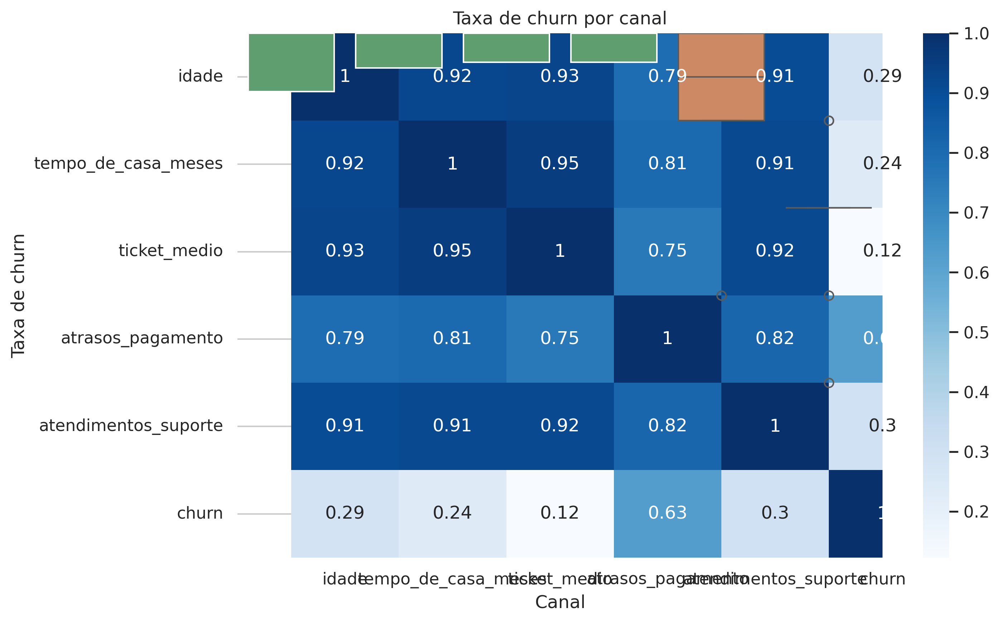
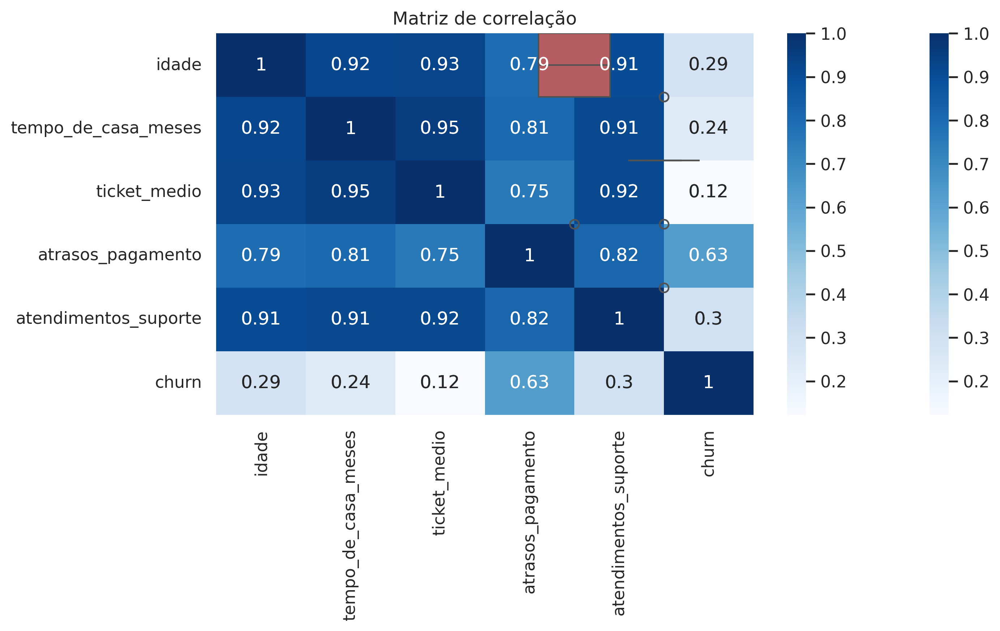

# 📉 Análise de Churn em Python

Este projeto apresenta uma análise exploratória de churn com o objetivo de identificar padrões de cancelamento, entender o comportamento dos clientes e destacar fatores que influenciam a retenção.  
A análise foi conduzida utilizando Python e bibliotecas amplamente utilizadas em ciência de dados.

---

## 🔗 Acesso Rápido

- 📘 **Notebook completo:** [notebooks/churn_analysis.ipynb](notebooks/churn_analysis.ipynb)  
- 📊 **Dataset utilizado:** [data/churn_clientes.csv](data/churn_clientes.csv)

---

## 🧠 Objetivo do Projeto

O churn (cancelamento) é um dos principais desafios de empresas que operam com receita recorrente.  
Este projeto busca responder:

- Quais fatores mais influenciam o churn?  
- Existem padrões de comportamento entre clientes que cancelam?  
- Quais segmentos apresentam maior risco?  
- Como variáveis como atrasos, suporte e ticket médio se relacionam com o cancelamento?

---

## 🔍 Principais Insights

- Clientes com maior número de **atrasos de pagamento** apresentam maior probabilidade de churn.  
- Segmentos com **menor ticket médio** concentram proporcionalmente mais cancelamentos.  
- **Queda de uso** do produto é um forte indicador de risco.  
- Clientes que acionam muito o **suporte** tendem a cancelar mais.  
- A matriz de correlação reforça que **engajamento e comportamento financeiro** são fatores críticos.

---

## 📊 Visualizações

As principais visualizações geradas no notebook incluem:

| Churn por Segmento | Churn por Canal |
|--------------------|-----------------|
|  |  |

| Tempo de Casa | Correlação |
|----------------|------------|
|  |  |

> As imagens acima são placeholders. Quando você gerar os gráficos no Jupyter, basta substituir os arquivos na pasta `images/`.

---

## 🛠️ Tecnologias Utilizadas

- **Python**
  - pandas  
  - numpy  
  - seaborn  
  - matplotlib  
- **Jupyter Notebook**  
- **Git & GitHub**

---

## ▶️ Como Reproduzir o Projeto

1. Clone este repositório:
   ```bash
   git clone https://github.com/llfaraco/churn-analysis-python.git

2. Instale as dependências: pip install -r requirements.txt

3. Abra o notebook: jupyter notebook notebooks/churn_analysis.ipynb

4. churn-analysis-python/
│
├── data/
│   └── churn_clientes.csv
│
├── images/
│   ├── churn_por_segmento.png
│   ├── churn_por_canal.png
│   ├── churn_tempo_de_casa.png
│   └── matriz_correlacao.png
│
├── notebooks/
│   └── churn_analysis.ipynb
│
└── README.md

